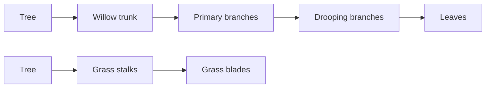

# Generator graph authoring

The `speedtree-nodes` skill edits native `.spm` projects and `.stt` generator
templates as files. Every edit writes a **new output file**. Regenerate that
result with the licensed Modeler exporter and read back the resulting geometry.

This is an experimental implementation of the compressed XML observed in
SpeedTree Modeler 10.1. It is not a vendor-published Modeler scripting SDK.
Modeler's documented [template commands](https://docs.unity3d.com/speedtree-modeler/manual/generation-editor-toolbar-reference.html)
support adding a template from a file and saving selected generators as a
template. Its [command-line exporter](https://docs.unity3d.com/speedtree-modeler/manual/export-from-the-command-line.html)
provides a separate regeneration/export check for the resulting SPM.

## Operations

| Operation | Contract |
| --- | --- |
| Inspect graph | Read generator identities, types, names, and directed links |
| Inspect properties | Enumerate the actual stored properties and components |
| Installed catalog | Enumerate actual template types and stored property names, with parse failures |
| Add | Instantiate an installed STT generator template with a fresh identity |
| Duplicate | Copy a generator with independent identity |
| Connect / disconnect | Edit directed generator relationships with graph validation |
| Rename | Change a generator's display name |
| Set hidden | Change the stored generator visibility flag; live UI state is unaffected |
| Remove | Remove a generator; descendant removal must be explicit |
| Set property | Edit an existing scalar or spline component by its observed name |
| Save | Create a new SPM/STT while preserving unrecognized document content |

Use returned generator IDs and property names. A generator can create many
individual branches or leaves; those generated geometry nodes are distinct
from the generator graph. Editing individual generated-node overrides, live
selection, materials, and undo/redo inside Modeler is outside this file API.

## Node demonstration

The showcase recipe starts from the installed blank template and adds actual
generators. Successive saved stages pair the graph with the model it generates:



Willow shape comes from branch length, start angle, and gravity; positive
gravity bends branches downward. Grass blades use frond geometry on their
stalks. These are documented [branch properties](https://docs.unity3d.com/speedtree-modeler/manual/branch-generator-properties.html).

Recipes reference the operator's installed templates. Vendor templates,
sample textures, SDK files, and application binaries are not redistributed.
Keep local source projects and raw export diagnostics outside the public
repository; exported-geometry renders and portable recipes form the README showcase.

## Reproduce

Start the standalone adapter with a licensed Modeler executable, discover its
instance ID with `dcc-mcp-cli list`, and use a **new** output directory. The
recipe targets installed Modeler 10.1 VFX templates; content layouts and
property meanings can differ in other releases.

```powershell
python scripts/build_node_showcases.py --content-root C:/Applications/SpeedTree `
  --output C:/Projects/SpeedTreeNodeDemo --instance-id <discovered-id>
python scripts/verify_node_showcases.py C:/Projects/SpeedTreeNodeDemo `
  --instance-id <discovered-id> `
  --preset C:/Applications/SpeedTree/export_presets/VFX/__Blender.ini
```

The first command discovers and calls the node tools, saving seven successive
projects and operation receipts. The second exports them, waits for terminal
Core job completion, verifies file hashes, and compares native geometry after
leaf deletion, disconnection, reconnection, and duplication. Re-running the
verification requires a fresh `operation-checks` destination; prior evidence
is retained. Preset units and materials need separate target validation.

For optional README visualization, install Blender and FFmpeg, then run:

```powershell
blender --background --factory-startup --python scripts/render_node_showcases.py `
  -- C:/Projects/SpeedTreeNodeDemo
python scripts/package_node_showcase.py C:/Projects/SpeedTreeNodeDemo `
  C:/Projects/SpeedTreeNodeDemo/showcase
```

The renderer reads the actual exported vertices and faces without changing
geometry. It adds display shading, lights, and a floor in a factory scene.
The diagram is drawn from saved IDs/links, and each highlighted generator is
referenced by that stage's operations. The packager produces PNG boards, a
GIF, an MP4, and portable provenance. It does not capture or simulate Modeler UI.

Measured Modeler 10.1.0 stages:

| Stage | Generators | Vertices | Faces |
| --- | ---: | ---: | ---: |
| Willow trunk | 2 | 77 | 140 |
| Primary branches | 3 | 693 | 1,252 |
| Drooping branches | 4 | 1,908 | 3,574 |
| Leaves | 5 | 7,092 | 6,166 |
| Grass stalks | 2 | 15,390 | 29,160 |
| Grass blades | 3 | 27,540 | 59,400 |
| Tapered clump | 3 | 27,540 | 59,400 |

Unchanged face counts in the final grass stage are expected: changing its
length and width curve changes vertex positions without changing topology.
The willow currently uses default rectangular leaf cards, not textured leaf
meshes. Wind, collision, UV quality, and native material fidelity are outside
this geometry demonstration.

Native operation regression on the final willow:

| Operation | Vertices | Faces |
| --- | ---: | ---: |
| Remove leaf generator | 1,908 | 3,574 |
| Disconnect leaf generator | 1,908 | 3,574 |
| Reconnect and rename | 7,092 | 6,166 |
| Duplicate and connect leaf generator | 12,276 | 8,758 |

All four variants completed through the native exporter. Removing and
disconnecting leaves recover the original bare-branch vertex positions;
reconnection recovers the complete willow positions. The checked hashes and
geometry counts are in [the acceptance receipt](node-showcase-acceptance.json).

## Validation boundaries

File parsing and graph validation prove the saved structure. They do not prove
that a licensed Modeler accepts it or that the geometry has regenerated.
Validate those separately with a real Modeler regeneration/export and geometry
readback. A successful process exit, cached SPM triangle statistics, and a
pre-existing thumbnail are insufficient evidence.

The adapter does not require a C++ or C# hook for this file workflow. A future
live integration should expose typed, versioned commands and authoritative
host readback through a verified extension boundary. The SpeedTree runtime
SDK or an engine importer does not establish a Modeler authoring interface.
