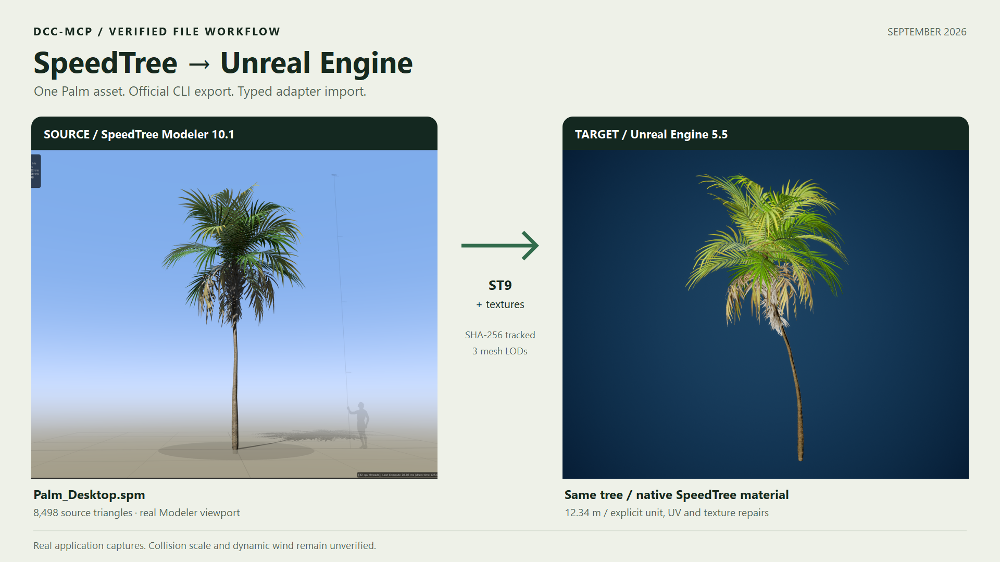

# Real source-to-Unreal capture

Captured on 2026-09-07: SpeedTree Modeler 10.1.0 and Unreal Engine 5.5.4.
The left panel is the actual Modeler viewport with `Palm_Desktop.spm` loaded.
The right panel is a native Unreal SceneCapture2D render of the same exported
ST9 tree. The composition crops and labels real captures; it contains no
generated tree imagery. Lighting and camera angles differ.

The official CLI produced the ST9 mesh and texture files. `dcc-mcp-unreal`
imported the tree and read back three LODs with 8,498, 5,396, and 2,346 triangles.
The showcase uses a duplicate mesh and material instances, with these explicit
repairs through official Unreal APIs:

- Refresh material instances to replace fallback rendering.
- Bind the actual Subsurface image in place of the packed Extra image.
- Apply `v_new = 1 - v_old` to UV0 on all three LODs and rebuild the duplicate.
- Convert the three LODs' vertex positions from feet to centimeters by 30.48,
  with build and actor scales both 1. Final bounds measure 1,234.383705 cm tall.

The resulting image uses the native `SpeedTreeMaster` material parent. Green
foliage and leaf transparency were inspected. This is not evidence of a
lossless default import. Collision scale and dynamic wind are unverified. The original imported assets
were retained and the previous editor level was restored.

[Public provenance](showcase-provenance.json) records the source and capture
hashes. Licensed model files, raw material sidecars, machine paths, and local
diagnostic logs are not included.
